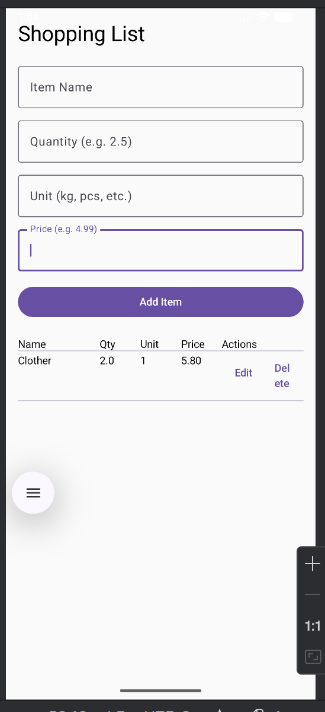

# Shopping List App (Android + Jetpack Compose + Room)

A clean, modern **shopping list app** built with **Jetpack Compose**, **Room Database**, and **Kotlin**.  
Add, edit, and delete items with name, quantity, unit, and price — all stored locally using **SQLite via Room**.

---

## Features

- **Add Items**: Enter item name, quantity, unit (e.g., kg, pcs), and price.
- **Edit Items**: Tap "Edit" to update any item.
- **Delete Items**: Remove items with one tap.
- **Real-time Updates**: List updates instantly using `Flow` + `collectAsState`.
- **Table View**: Clean table layout with headers and rows.
- **Local Persistence**: Data saved using **Room Database**.
- **Input Validation**: Prevents invalid entries with toast feedback.

---

## Tech Stack

| Technology               | Version     |
|--------------------------|-------------|
| **Kotlin**               | 2.0.21      |
| **Android API**          | 35 (VanillaIceCream) |
| **Jetpack Compose**      | BOM 2024.09.00 |
| **Room Database**        | 2.6.1       |
| **Lifecycle & ViewModel**| 2.6.2       |
| **KSP**                  | 2.0.21-1.0.27 |

---

## Screenshot

